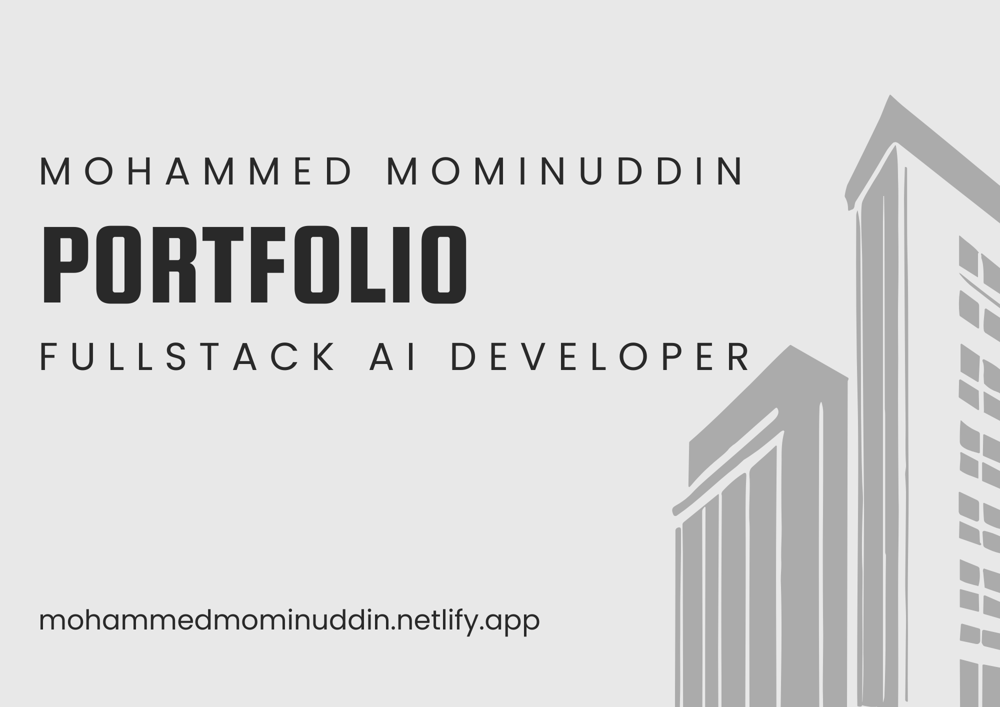

<h1 align="center">
    
</h1>

<h1 align="center">
  <a href="https://mohammedmominuddin.netlify.app/"> Mohammed Mominuddin Portfolio ⚡️</a>
</h1>

<h3 align="center"></h3>

<p align="center">
  
  <a href="https://github.com/Mominuddin07/Mominuddin-Portfolio">
    
  </a>
  
  <a href="https://github.com/Mominuddin07/">
    
  </a>
</p>

<h4 align="center"> 
	 Status: Finished
</h4>

## Features

⚡️ Modern UI Design + Reveal Animations
⚡️ One Page Layout   
⚡️ Fully Responsive  
⚡️ Contact Form Integration with EmailJS
⚡️ Optimized for fast performance  
⚡️ Well-organized documentation  
⚡️ 3D Animations
⚡️ Styled with React Material UI

## To view the demo:
[Click here](https://mohammedmominuddin.netlify.app/) to see the live version.


---


## How it works

1. **Frontend**: Built using **React.js** for building the user interface and managing state.
2. **Styling**: Styled with **Material UI** for modern, responsive design components.
3. **Contact Form**: Uses **EmailJS** to handle form submissions and send emails without needing a backend server.
4. **Responsive Design**: The website is fully responsive, providing an optimal experience on both mobile and desktop devices.

### Pre-requisites

Before you begin, ensure that you have the following tools installed:

- [Node.js](https://nodejs.org/)  
- [Git](https://git-scm.com)  
- A code editor like [VSCode](https://code.visualstudio.com/)

#### Running the web application (Frontend)

```bash
# Clone the repository
$ git clone git@github.com:Mominuddin07/Mominuddin-Portfolio.git

# Navigate to the project directory
$ cd Mominuddin-Portfolio

# Install dependencies
$ npm install

# Start the application
$ npm start

# The application will run on http://localhost:3000\

```

## Author

<a href="https://www.linkedin.com/in/mohammed-mominuddin-350180259/">
 
 <br />
 <p><b>Mohammed Mominuddin</b></p></a>
 
[](https://www.linkedin.com/in/mohammed-mominuddin-350180259/)

---

## License

This project is under the license [MIT](./LICENSE).

Made with love by Mohammed Mominuddin 👋🏽 [Get in Touch!](https://www.linkedin.com/in/mohammed-mominuddin-350180259/)

---
## Learn More

This project was created using **React.js** and **Material UI**, with **HTML**, **CSS**, and **JavaScript** used for basic structure and functionality.

- **HTML**: Used for creating the basic structure of the website. 
- **CSS**: Applied for styling the website, though the design and layout were mainly driven by **Material UI**. 
- **JavaScript**: Used for basic interactivity, although most dynamic functionality is handled by **React.js**.
- **React.js**: The core technology used for building a modern and dynamic user interface, allowing for component-based architecture and state management. 
- **Material UI**: Used extensively for designing the user interface with pre-built components and ensuring responsiveness. 

These technologies together allow for the creation of responsive and interactive web applications with minimal backend dependencies.


